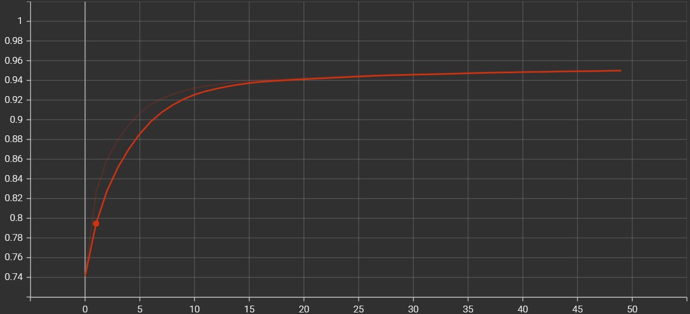
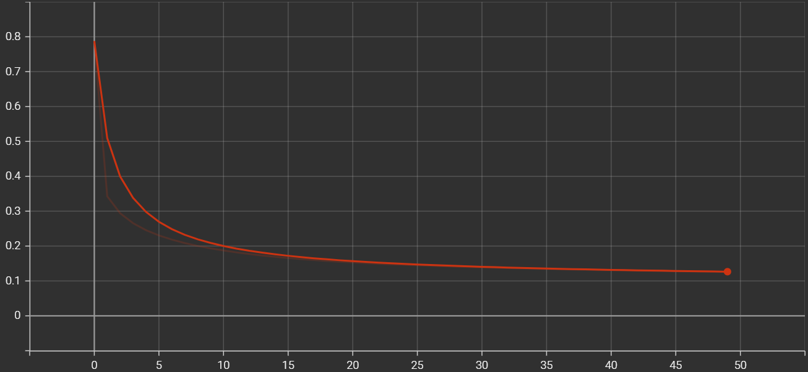

<!DOCTYPE html>
<html lang="en">
<head>
    <meta charset="UTF-8">
    <meta name="viewport" content="width=device-width, initial-scale=1.0">
</head>
<body>

<h1>Neural Collaborative Filtering (NCF)</h1>

This repository contains an implementation of Neural Collaborative Filtering (NCF) using Keras.

<h2>Description</h2>

Neural Collaborative Filtering (NCF) leverages neural networks to model implicit interactions between users and items for recommendation systems. This implementation uses the MovieLens dataset to create a Neural Matrix Factorization (NeuMF) model, focusing on implicit interactions.

The implementation is based on the paper <a href="https://arxiv.org/abs/1708.05031" target="_blank">Neural Collaborative Filtering</a> by Xiangnan He et al.

<h2>Features</h2>
<ul>
    <li><strong>Data</strong>: Uses the MovieLens dataset.</li>
    <li><strong>Model</strong>: NeuMF architecture combining Generalized Matrix Factorization (GMF) and Multi-Layer Perceptron (MLP).</li>
    <li><strong>Training</strong>: Tracks accuracy and loss metrics.</li>
</ul>

<h2>Installation</h2>
<ol>
    <li>Clone the repository:
        <pre><code>git clone https://github.com/iushranjan/ncf.git
cd ncf
        </code></pre>
    </li>
    <li>Install required libraries:
        <pre><code>pip install -r requirements.txt
        </code></pre>
    </li>
</ol>

<h2>Usage</h2>
<ol>
    <li>Preprocess the dataset:
        <pre><code>python preprocess.py
        </code></pre>
    </li>
    <li>Train the model:
        <pre><code>python ncf.py
        </code></pre>
    </li>
</ol>

<h2>Results</h2>

<h3>Accuracy</h3>

<h3>Loss</h3>

<h2>Contributing</h2>

Feel free to open issues or submit pull requests for improvements or bug fixes.

<h2>License</h2>

This project is licensed under the MIT License.

</body>
</html>
